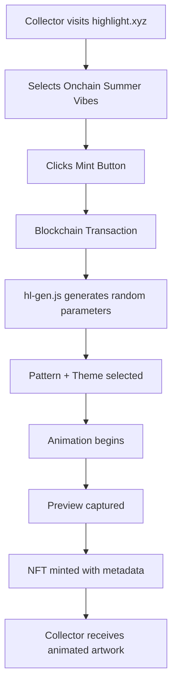
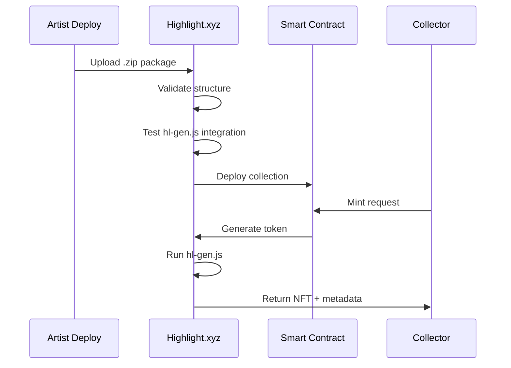
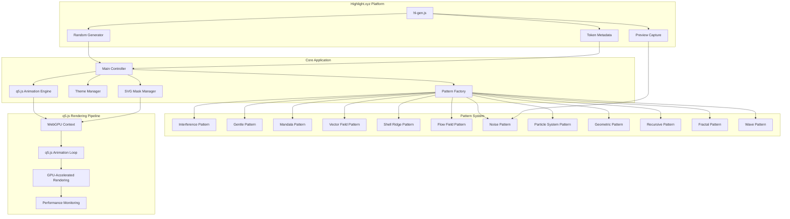
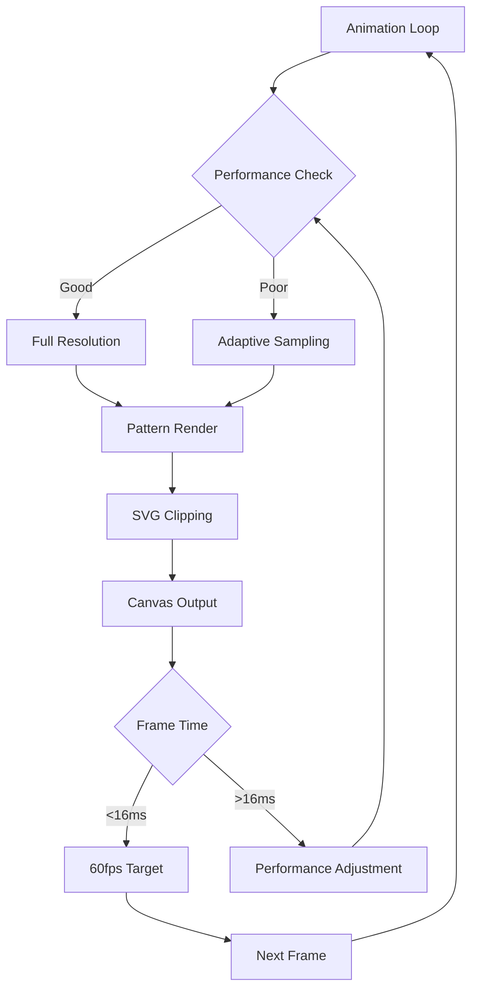
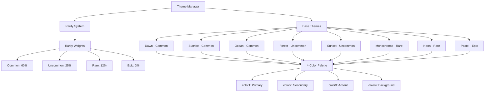
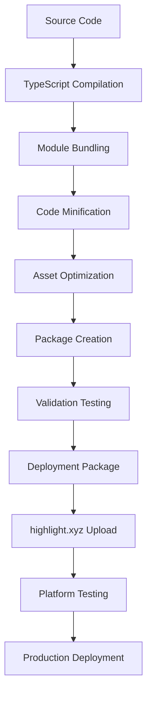

# PLANNING PRD: Onchain Summer Vibes - Highlight.xyz Generative Art Integration

## Executive Summary

**Project Vision**: Transform the existing React-based wave pattern visualization system into a production-ready generative art NFT collection for the highlight.xyz platform, where each mint produces a unique combination of animated patterns and color themes within the "Onchain Summer" logo shape.

**Core Value Proposition**: 
- **For Collectors**: Unique, animated NFT artwork that runs perpetually with high visual fidelity
- **For Platform**: Showcase of advanced generative art capabilities on highlight.xyz
- **For Artist**: Scalable NFT collection with zero creator fees and technical innovation

**Success Metrics**:
- 100% deterministic randomness (same seed = same output)
- 60fps animation performance on desktop browsers
- <3 second initial load time
- 90%+ successful mint rate on highlight.xyz platform
- 5,000+ unique combinations possible

## Problem & Solution

### Problem Statement

**Current State**: Advanced wave pattern system exists as React development application with manual controls and editor interface.

**Challenge**: Need to convert to production-ready generative art that:
1. Runs on highlight.xyz platform with their specific requirements
2. Generates unique, deterministic artwork per mint
3. Maintains high animation performance without development controls
4. Provides sufficient variety for a collectible NFT series

### Solution Overview

**Technical Transformation**: Convert React TypeScript application to q5.js-powered JavaScript with highlight.xyz hl-gen.js integration for deterministic randomness and NFT metadata management.

**q5.js Performance Advantages**:
- WebGPU-powered graphics library (30-50x faster than p5.js)
- Optimized for interactive art and generative applications
- 4x faster than p5.js 2D renderer, 16x faster than p5.js WebGL renderer
- Lightweight (~100kb minified) with no external dependencies
- Compatible with p5.js ecosystem (p5.sound, ml5.js, p5play)
- Beginner-friendly API similar to p5.js/Processing

**Creative Framework**: Implement randomization system that selects from:
- 12+ pattern types (5 existing + 7 new from creative coding references)
- 8+ color themes (3 existing + 5 new)
- Configurable parameter ranges per pattern
- Rarity distribution system

## User Stories & Flows

### Epic 1: Collector Minting Experience

#### Story 1.1: Basic Minting Flow
**As a** NFT collector  
**I want** to mint an Onchain Summer Vibes artwork  
**So that** I receive a unique, animated generative art piece  

**User Flow:**


**Acceptance Criteria:**
- [ ] Each mint produces visually distinct artwork
- [ ] Animation starts immediately after mint
- [ ] Smooth 60fps performance maintained
- [ ] Deterministic output (same seed = same result)
- [ ] Proper metadata and traits assigned

#### Story 1.2: Long-term Viewing
**As a** NFT owner  
**I want** my artwork to animate consistently  
**So that** I can display it as living art  

**Acceptance Criteria:**
- [ ] Animation runs indefinitely without degradation
- [ ] Memory usage remains stable (<100MB)
- [ ] Works across different browsers and devices
- [ ] Consistent visual output over time

### Epic 2: Platform Integration

#### Story 2.1: Highlight.xyz Compatibility
**As a** platform operator  
**I want** the artwork to comply with highlight.xyz requirements  
**So that** it deploys successfully and functions properly  

**Technical Flow:**


**Acceptance Criteria:**
- [ ] Package size <2GB
- [ ] All assets local (no external dependencies)
- [ ] hl-gen.js properly integrated
- [ ] Deterministic randomness working
- [ ] Preview capture functioning

## Technical Architecture

### System Components



### Data Flow Architecture

```mermaid
graph LR
    subgraph "Initialization"
        A[Blockchain Transaction] --> B[hl.random() seed]
        B --> C[Generate Config]
    end
    
    subgraph "Configuration"
        C --> D[Pattern Selection]
        C --> E[Theme Selection]
        C --> F[Parameter Generation]
    end
    
    subgraph "Runtime"
        D --> G[Pattern Renderer]
        E --> H[Color System]
        F --> I[Animation Parameters]
        G --> J[Canvas Context]
        H --> J
        I --> J
    end
    
    subgraph "Output"
        J --> K[Visual Animation]
        J --> L[Preview Capture]
        K --> M[NFT Display]
        L --> N[Token Metadata]
    end
```

### Performance Architecture



## Pattern & Theme System Design

### Pattern Architecture

```mermaid
classDiagram
    class Q5PatternRenderer {
        +render(q5, width, height, time, params, theme)
        +setup(q5, params)
        +getParameterRanges()
        +calculateComplexity(params)
        +getPerformanceProfile()
        +useWebGPU: boolean
    }
    
    class InterferencePattern {
        +wavelength: 20-100
        +sources: 2-6
        +gradientMode: boolean
        +threshold: 0.3-0.8
    }
    
    class GentlePattern {
        +wavelength: 30-120
        +lineDensity: 0.5-2.0
        +flowDirection: enum
    }
    
    class MandalaPattern {
        +complexity: 3-12
        +speed: 0.5-2.0
        +ringCount: 4-8
    }
    
    class VectorFieldPattern {
        +tileSize: 20-80
        +shiftAmplitude: 0.5-2.0
        +lineCount: 50-200
    }
    
    class ShellRidgePattern {
        +rings: 5-20
        +distortion: 0.1-0.5
        +texture: enum
    }
    
    class FlowFieldPattern {
        +fieldResolution: 10-50
        +particleCount: 100-500
        +forceStrength: 0.1-1.0
        +trailLength: 10-100
    }
    
    class NoisePattern {
        +scale: 0.005-0.02
        +octaves: 1-6
        +persistence: 0.3-0.8
        +lacunarity: 1.5-3.0
    }
    
    class GeometricPattern {
        +shapeType: enum
        +repetition: 3-20
        +rotation: 0-360
        +scaling: 0.5-2.0
    }
    
    class RecursivePattern {
        +depth: 3-8
        +branchFactor: 2-5
        +angleVariation: 15-45
        +sizeReduction: 0.6-0.9
    }
    
    class FractalPattern {
        +iterations: 50-200
        +zoom: 0.5-2.0
        +juliaC: complex
        +colorCycle: 10-50
    }
    
    class WavePattern {
        +frequency: 0.01-0.1
        +amplitude: 10-100
        +phaseShift: 0-TWO_PI
        +waveType: enum
    }
    
    Q5PatternRenderer <|-- InterferencePattern
    Q5PatternRenderer <|-- GentlePattern
    Q5PatternRenderer <|-- MandalaPattern
    Q5PatternRenderer <|-- VectorFieldPattern
    Q5PatternRenderer <|-- ShellRidgePattern
    Q5PatternRenderer <|-- FlowFieldPattern
    Q5PatternRenderer <|-- NoisePattern
    Q5PatternRenderer <|-- GeometricPattern
    Q5PatternRenderer <|-- RecursivePattern
    Q5PatternRenderer <|-- FractalPattern
    Q5PatternRenderer <|-- WavePattern
```



### Theme System Design



## API Specifications

### hl-gen.js Integration

```javascript
// Main q5.js Integration API
class OnchainSummerVibes {
  constructor() {
    this.q5 = null;
    this.config = this.generateConfiguration();
    this.setTokenMetadata();
    this.initializeQ5();
  }

  initializeQ5() {
    // Initialize q5.js with WebGPU support
    this.q5 = new Q5('webgpu');
    
    this.q5.setup = () => {
      this.q5.createCanvas(800, 600);
      this.setupPattern();
    };
    
    this.q5.draw = () => {
      this.renderFrame();
    };
  }

  generateConfiguration() {
    return {
      pattern: hl.randomElement([
        'interference', 'gentle', 'mandala', 
        'vectorField', 'shellRidge', 'flowField',
        'noise', 'geometric', 'recursive', 
        'fractal', 'wave'
      ]),
      theme: hl.randomElement([
        'dawn', 'sunrise', 'ocean', 'forest',
        'sunset', 'monochrome', 'neon', 'pastel'
      ]),
      params: this.generateRandomParameters()
    };
  }

  generateRandomParameters() {
    const parameterRanges = {
      interference: {
        wavelength: [20, 100],
        sources: [2, 6], 
        gradientMode: [true, false],
        threshold: [0.3, 0.8]
      },
      // ... other patterns
    };
    
    const ranges = parameterRanges[this.config.pattern];
    const params = {};
    
    for (const [key, range] of Object.entries(ranges)) {
      if (typeof range[0] === 'boolean') {
        params[key] = hl.randomElement(range);
      } else if (Number.isInteger(range[0])) {
        params[key] = hl.randomInt(range[0], range[1]);
      } else {
        params[key] = range[0] + hl.random() * (range[1] - range[0]);
      }
    }
    
    return params;
  }

  setTokenMetadata() {
    hl.token.setName(`Onchain Summer Vibes #${hl.randomInt(1, 10000)}`);
    hl.token.setDescription(`Animated wave patterns in ${this.config.theme} theme`);
    hl.token.setTraits({
      "Pattern Type": this.config.pattern,
      "Theme": this.config.theme,
      "Rarity": this.calculateRarity(),
      "Complexity": this.calculateComplexity(),
      "Animation Speed": this.categorizeSpeed(),
      "Color Palette": this.categorizeColors()
    });
  }

  calculateRarity() {
    const rarityMap = {
      dawn: 'Common', sunrise: 'Common', ocean: 'Common',
      forest: 'Uncommon', sunset: 'Uncommon',
      monochrome: 'Rare', neon: 'Rare',
      pastel: 'Epic'
    };
    return rarityMap[this.config.theme];
  }
}
```

### Pattern Factory API

```javascript
class Q5PatternFactory {
  constructor(q5Instance) {
    this.q5 = q5Instance;
  }

  createPattern(type, params, theme) {
    const PatternClass = this.getPatternClass(type);
    return new PatternClass(this.q5, params, theme);
  }

  getPatternClass(type) {
    const patterns = {
      interference: InterferencePattern,
      gentle: GentlePattern,
      mandala: MandalaPattern,
      vectorField: VectorFieldPattern,
      shellRidge: ShellRidgePattern,
      flowField: FlowFieldPattern,
      noise: NoisePattern,
      geometric: GeometricPattern,
      recursive: RecursivePattern,
      fractal: FractalPattern,
      wave: WavePattern
    };
    
    return patterns[type] || InterferencePattern;
  }

  getAvailablePatterns() {
    return Object.keys(this.patterns);
  }

  getPatternComplexity(type, params) {
    const pattern = this.createPattern(type, params, {});
    return pattern.calculateComplexity(params);
  }

  // WebGPU-specific optimizations
  enableWebGPUOptimizations() {
    return this.q5.webglVersion === 'webgpu';
  }
}
```

## Creative Coding Pattern Sources & References

### Pattern Development Strategy

**Existing Patterns (React → q5.js Conversion)**:
- Interference Pattern: Wave interference with multiple sources
- Gentle Pattern: Flowing sinusoidal lines
- Mandala Pattern: Geometric mandala with breathing animations
- Vector Field Pattern: Particle flow following vector fields
- Shell Ridge Pattern: Concentric ridged patterns with distortion

**New Pattern Types (Creative Coding References)**:
- **Flow Field Pattern**: Perlin noise-based vector field with particle systems
- **Noise Pattern**: Multi-octave noise landscapes with dynamic coloring
- **Geometric Pattern**: Tessellations, Islamic patterns, and geometric recursion
- **Recursive Pattern**: L-systems, tree structures, and fractal recursion
- **Fractal Pattern**: Julia sets, Mandelbrot variations, and complex dynamics
- **Wave Pattern**: Standing waves, interference patterns, and wave equations

### Pattern Research Sources

**Primary References**:
- The Way of Code (thewayofcode.com) - React-based creative coding modules
- The Nature of Code by Daniel Shiffman - Algorithmic pattern foundations
- Generative Design patterns - Parametric design techniques
- Creative Coding community examples - GitHub repositories and CodePen demos

**Technical Implementation Sources**:
- q5.js documentation and examples
- WebGPU shader techniques for performance
- Math and physics-based pattern generation
- Perlin noise and procedural generation techniques

### Pattern Selection Criteria

**Visual Appeal**: Patterns must be visually striking within the SVG logo shape
**Performance**: Must maintain 60fps with WebGPU acceleration
**Parametric Variety**: Sufficient parameters for unique combinations
**Rarity Distribution**: Patterns should support different complexity levels
**Generative Potential**: Patterns should evolve over time for engaging animations

### Pattern Implementation Workflow

1. **Research Phase**: Identify creative coding patterns from reference sources
2. **Analysis Phase**: Understand mathematical foundations and parameter spaces
3. **Conversion Phase**: Convert from original framework to q5.js
4. **Optimization Phase**: Leverage WebGPU for performance improvements
5. **Integration Phase**: Implement parameter randomization and theme integration
6. **Testing Phase**: Validate visual quality and performance metrics

## Data Models

### Configuration Model

```javascript
interface ArtworkConfig {
  pattern: PatternType;
  theme: ThemeType;
  params: PatternParameters;
  seed: string;
  timestamp: number;
  metadata: TokenMetadata;
}

interface PatternParameters {
  [key: string]: number | boolean | string;
}

interface TokenMetadata {
  name: string;
  description: string;
  traits: TraitCollection;
  rarity: RarityLevel;
  complexity: ComplexityLevel;
}

interface TraitCollection {
  "Pattern Type": PatternType;
  "Theme": ThemeType;
  "Rarity": RarityLevel;
  "Complexity": ComplexityLevel;
  "Animation Speed": SpeedCategory;
  "Color Palette": ColorCategory;
}

type PatternType = 'interference' | 'gentle' | 'mandala' | 'vectorField' | 'shellRidge' | 'flowField' | 'noise' | 'geometric' | 'recursive' | 'fractal' | 'wave';
type ThemeType = 'dawn' | 'sunrise' | 'ocean' | 'forest' | 'sunset' | 'monochrome' | 'neon' | 'pastel';
type RarityLevel = 'Common' | 'Uncommon' | 'Rare' | 'Epic';
type ComplexityLevel = 'Low' | 'Medium' | 'High';
```

### Animation State Model

```javascript
interface AnimationState {
  isRunning: boolean;
  currentTime: number;
  frameCount: number;
  fps: number;
  performance: PerformanceMetrics;
  lastPreviewCapture: number;
}

interface PerformanceMetrics {
  averageFrameTime: number;
  memoryUsage: number;
  droppedFrames: number;
  adaptiveSampling: boolean;
}
```

## Implementation Phases

### Phase 1: Foundation & Platform Integration (Week 1-2)

**Objectives:**
- Set up highlight.xyz project structure
- Implement hl-gen.js integration
- Create basic randomization system
- Establish build pipeline

**Key Deliverables:**
- [ ] Working hl-gen.js integration with deterministic randomness
- [ ] Basic pattern and theme selection system
- [ ] Token metadata generation
- [ ] Preview capture functionality
- [ ] Build and deployment pipeline

**Technical Focus:**
- Convert React hooks to q5.js-based classes
- Implement WebGPU-accelerated rendering with q5.js
- Set up deterministic randomness using hl.random()
- Create modular architecture leveraging q5.js ecosystem
- Integrate q5.js with highlight.xyz platform requirements

### Phase 2: Pattern System Conversion (Week 3-4)

**Objectives:**
- Convert all existing patterns to q5.js with WebGPU acceleration
- Research and implement creative coding patterns from reference sources
- Optimize performance leveraging WebGPU capabilities
- Implement parameter randomization with q5.js integration

**Key Deliverables:**
- [ ] All 5 original patterns converted to q5.js and optimized
- [ ] 6 new pattern types implemented from creative coding references
- [ ] WebGPU performance optimization achieving 60fps target
- [ ] Parameter range system with q5.js random integration
- [ ] Pattern complexity calculation system with WebGPU profiling

**Technical Focus:**
- Leverage q5.js WebGPU renderer for 30-50x performance improvements
- Research and convert creative coding patterns from thewayofcode.com
- Implement instanced rendering for geometric patterns
- Optimize GPU memory usage and shader switching
- Add pattern-specific rarity calculations with WebGPU metrics

### Phase 3: Enhanced Theme System (Week 5)

**Objectives:**
- Expand theme collection
- Implement rarity distribution
- Create color harmony system
- Add theme-specific effects

**Key Deliverables:**
- [ ] 5 new theme palettes implemented
- [ ] Rarity distribution system (Common/Uncommon/Rare/Epic)
- [ ] Color harmony validation
- [ ] Theme-specific pattern modifications
- [ ] Advanced color blending algorithms

**Technical Focus:**
- Color theory implementation for pleasing palettes
- Rarity weighting system
- Theme-pattern interaction effects
- Color accessibility considerations

### Phase 4: SVG Masking & Animation Engine (Week 6)

**Objectives:**
- Optimize SVG clipping performance
- Implement advanced animation features
- Add responsive design support
- Create animation state management

**Key Deliverables:**
- [ ] Optimized SVG clipping path system
- [ ] Advanced animation engine with state management
- [ ] Responsive design for different screen sizes
- [ ] Animation performance monitoring
- [ ] Memory leak prevention

**Technical Focus:**
- Canvas clipping optimization over SVG masking
- Efficient animation loop with performance monitoring
- Adaptive rendering based on device capabilities
- Proper cleanup and resource management

### Phase 5: Testing & Optimization (Week 7)

**Objectives:**
- Comprehensive testing across devices
- Performance benchmarking
- Edge case handling
- Quality assurance

**Key Deliverables:**
- [ ] Comprehensive test suite
- [ ] Performance benchmarks on multiple devices
- [ ] Browser compatibility testing
- [ ] Long-term stability testing (24+ hours)
- [ ] Error handling and recovery systems

**Technical Focus:**
- Automated testing for deterministic output
- Performance regression testing
- Cross-browser compatibility
- Mobile device optimization

### Phase 6: Deployment & Launch (Week 8)

**Objectives:**
- Final deployment to highlight.xyz
- Launch preparation
- Documentation creation
- Post-launch monitoring

**Key Deliverables:**
- [ ] Production deployment package
- [ ] highlight.xyz platform integration testing
- [ ] Launch documentation and marketing materials
- [ ] Monitoring and analytics setup
- [ ] Post-launch support plan

**Technical Focus:**
- Final optimization and bug fixes
- Platform-specific testing
- Monitoring and alerting setup
- Documentation for future maintenance

## Risk Assessment & Mitigation

### Technical Risks

#### Risk 1: WebGPU Browser Support
**Probability:** Medium  
**Impact:** High  
**Mitigation Strategy:**
- Implement Canvas 2D fallback for unsupported browsers
- Create feature detection system
- Provide graceful degradation to q5.js 2D mode
- Monitor WebGPU adoption rates across target demographics

#### Risk 2: Performance Degradation
**Probability:** Low (with WebGPU)  
**Impact:** High  
**Mitigation Strategy:**
- Leverage q5.js WebGPU 30-50x performance improvements
- Implement adaptive sampling system
- Create performance monitoring dashboard
- Establish multiple rendering fallback modes
- Conduct extensive device testing across WebGPU-capable devices

#### Risk 3: highlight.xyz Platform Compatibility
**Probability:** Medium  
**Impact:** High  
**Mitigation Strategy:**
- Early and frequent platform testing
- Direct communication with highlight.xyz support
- Backup deployment strategy
- Thorough documentation review

#### Risk 4: Deterministic Randomness Issues
**Probability:** Low  
**Impact:** Critical  
**Mitigation Strategy:**
- Extensive testing with same seeds
- Automated validation of deterministic output
- Fallback random number generation
- Comprehensive logging system

### Market Risks

#### Risk 5: Limited Pattern Variation
**Probability:** Low  
**Impact:** Medium  
**Mitigation Strategy:**
- Mathematical analysis of combination space
- User testing for perceived variety
- Iterative pattern parameter adjustment
- Community feedback integration

#### Risk 6: Animation Performance on Mobile
**Probability:** Medium  
**Impact:** Medium  
**Mitigation Strategy:**
- Progressive enhancement approach
- Device-specific optimization
- Graceful degradation system
- Performance budgets per device class

## Success Metrics & KPIs

### Technical Performance Metrics

**Animation Performance:**
- Target: 60fps on desktop, 30fps minimum on mobile
- Measurement: Frame rate monitoring with Web Performance API
- Success Threshold: 95% of time above target FPS

**Load Time:**
- Target: <3 seconds initial load
- Measurement: Time from page load to first animation frame
- Success Threshold: 95th percentile under 3 seconds

**Memory Usage:**
- Target: <100MB steady state
- Measurement: Memory profiling over 24-hour period
- Success Threshold: No memory leaks, stable usage

### Platform Integration Metrics

**Deployment Success Rate:**
- Target: 100% successful deployments
- Measurement: highlight.xyz platform deployment logs
- Success Threshold: Zero deployment failures

**Deterministic Consistency:**
- Target: 100% reproducible output
- Measurement: Automated testing with identical seeds
- Success Threshold: Zero variation in output for same seed

### User Experience Metrics

**Visual Quality:**
- Target: High perceived quality and variety
- Measurement: User feedback and A/B testing
- Success Threshold: 90% positive feedback on visual appeal

**Collection Uniqueness:**
- Target: 5,000+ unique combinations
- Measurement: Mathematical analysis of parameter space
- Success Threshold: Statistical rarity distribution achieved

## Technical Dependencies

### External Dependencies

**highlight.xyz Platform:**
- hl-gen.js library (latest version)
- Platform deployment tools
- Smart contract integration
- Preview capture system

**Browser APIs:**
- WebGPU API (primary rendering)
- Canvas 2D Context (fallback)
- RequestAnimationFrame
- Performance API
- Web Workers (if needed)

**q5.js Dependencies:**
- q5.js WebGPU renderer (~100kb)
- Compatible with p5.js ecosystem addons
- WebGPU shader support
- Instanced rendering capabilities

### Internal Dependencies

**Pattern System:**
- All existing pattern renderers
- Parameter configuration system
- Performance optimization utilities
- Color management system

**Animation Engine:**
- Canvas rendering pipeline
- SVG clipping system
- Animation state management
- Performance monitoring

## Deployment Strategy

### Build Pipeline



### Quality Gates

**Pre-deployment Checklist:**
- [ ] All tests passing (unit, integration, performance)
- [ ] Deterministic output validated
- [ ] Performance benchmarks met
- [ ] Browser compatibility verified
- [ ] Security review completed
- [ ] Documentation updated

**Platform Testing:**
- [ ] Successful upload to highlight.xyz
- [ ] Test minting process
- [ ] Metadata validation
- [ ] Preview capture testing
- [ ] Cross-browser verification

## Monitoring & Analytics

### Performance Monitoring

**Real-time Metrics:**
- Frame rate tracking
- Memory usage monitoring
- Error rate tracking
- Load time measurement

**Alerting System:**
- Performance degradation alerts
- Error rate thresholds
- Memory leak detection
- Platform availability monitoring

### User Analytics

**Engagement Metrics:**
- Mint success rate
- Animation viewing time
- Pattern popularity
- Theme preferences

**Quality Metrics:**
- User satisfaction scores
- Visual quality ratings
- Performance feedback
- Bug reports and issues

## Conclusion

This comprehensive planning document provides the roadmap for transforming the Onchain Summer Vibes wave pattern system into a production-ready generative art NFT collection on the highlight.xyz platform. The adoption of q5.js with WebGPU acceleration represents a significant technical upgrade that will deliver 30-50x performance improvements over traditional Canvas 2D rendering.

The project leverages existing technical foundations while adding the necessary randomization, platform integration, and cutting-edge WebGPU optimization features required for a successful NFT deployment. The integration of creative coding patterns from reference sources will expand the collection to 11+ unique pattern types, providing substantial variety and rarity distribution.

**Key Technical Advantages:**
- WebGPU-powered rendering for exceptional performance
- Expanded pattern library with creative coding references
- Lightweight q5.js framework (~100kb) with p5.js ecosystem compatibility
- Advanced instanced rendering for geometric patterns
- Efficient GPU memory management and shader optimization

With proper execution of this plan, the collection will showcase state-of-the-art generative art capabilities while providing collectors with unique, high-quality animated artwork that leverages the latest web graphics technology.

**Next Steps:**
1. Review and approve this planning document
2. Set up development environment and tools
3. Begin Phase 1 implementation
4. Establish regular progress reviews and milestone checkpoints
5. Prepare for highlight.xyz platform integration testing

This planning document serves as the foundation for creating a detailed implementation PRP that will guide the development process with specific technical requirements and validation criteria.